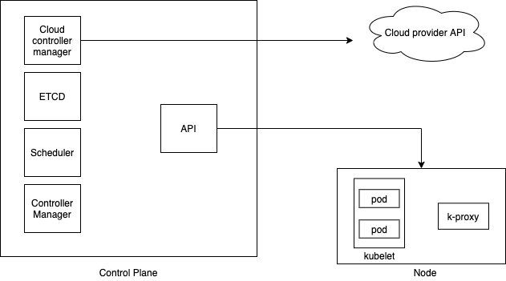

# Docker homework
## Activation of the local framework
1. `minikube start --vm-driver virtualbox`
2. `minikube addons enable ingress`
3. `kubectl apply -f deployment.yaml`
4. `kubectl apply -f service.yaml`
5. `minikube tunnel`
6. `kubectl apply -f ingress.yaml`
7. `kubectl get ingress` check address here and record it in etc/hosts
example `192.168.99.100 mynodeapp.com`
8. `curl mynodeapp.com`
9. Hello world!

## Concepts
### kubectl logs
Print the logs for a container in a pod or specified resource. I
### kubectl describe
Show details of a specific resource or group of resources
### apply
Apply a configuration to a resource by filename or stdin
### delete
Delete resources by filenames, stdin, resources and names, or by resources and label selector.
## components

### Pod
smallest, most basic deployable objects in Kubernetes 
Pods contain one or more containers, such as Docker containers. 
### Deployment
Deployments represent a set of multiple, identical Pods with no unique identities. A Deployment runs multiple replicas of your application and automatically replaces any instances that fail or become unresponsive. 
### Node
A Pod always runs on a Node. A Node is a worker machine in Kubernetes and may be either a virtual or a physical machine, depending on the cluster.
### Service
An abstract way to expose an application running on a set of Pods as a network service.
### Ingress
ingress acts one single entry point to our cluster which then routes to different services   
When ingress is deployed, an ingress-controller pod is setup which gets the traffic and then sends it to service
### ReplicaSet
ReplicaSets are higher-level abstractions that are responsible for ensuring that a specified number of exact copies of a given pod are running.  
This is different than a ReplicaSet in that you can roll out changes to the desired state of the system by changing the pod template in your deployment YAML, and the deployment will take care of the rest. You can also revert to a previous state if things go awry. This contrasts with a ReplicaSet in that if you were to change the ReplicaSet’s YAML, and then run kubectl apply -f <replicaset.yml> your original ReplicaSet will persist. And with that, you’ll be creating a second ReplicaSet. </replicaset.yml>
### Namespace
Namespaces are a way to organize clusters into virtual sub-clusters — they can be helpful when different teams or projects share a Kubernetes cluster. 
